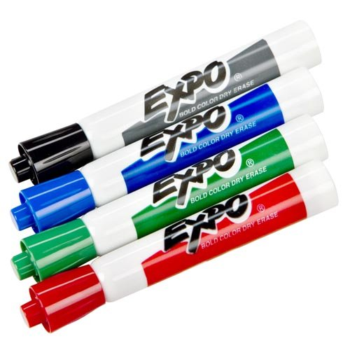
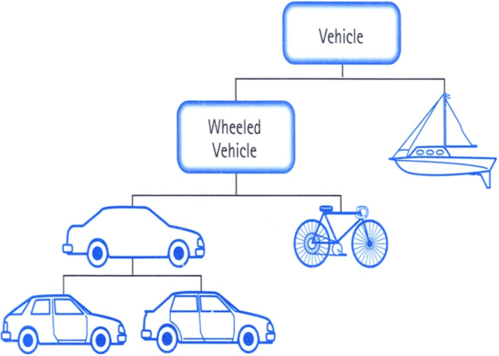

---
revealOptions:
    transition: 'none'
---


## Intermediate Python
### Class 1

---

## What you'll need

* A text editor
* Terminal
* Python 3
  * [Installation guide](http://docs.python-guide.org/en/latest/starting/installation/)
  * If you don't have this installed, you can use [repl.it](https://repl.it/languages/python3) for today

---

## Welcome

Girl Develop It is here to provide affordable
and accessible programs to learn software through mentorship and hands-on instruction.


<br/>

Some "rules":

* We are here for you!
* Every question is important
* Help each other
* Have fun

---

## Welcome

* Who are you?
* What do you hope to get out of the class?
* What music did you listen to today?

---

## Where we're headed

* Object-oriented programming (OOP)
* Handling errors
* Modules and packages
* Using 3rd party packages
* Web concepts
* Building a web app with Python
* A little bit of NLP?

---

<div class="left-align">
  <h2>Object</h2>
  <h2>Oriented</h2>
  <h2>Programming</h2>
</div>

---

# What is OOP?

---

## A **modeling technique**

---

### A **modeling technique**

When programs get large, we need a way to organize our code...

---


### A **modeling technique**

Group properties and behavior into logical units

* *classes*: The blueprints that create...
* *instances*: The real objects.

---


<small>Photo credit: Wikimedia Commons</small>

---

Classes implement...

* *methods*: The behavior that instances will have (`refuel`, `setSpeed`)
* *attributes*: The properties that instances will have (`fuel`, `maxspeed`)

---

### Let's develop it (conceptually)




<small>Photo credit: David Guo</small>

Note: What are the properties of this marker? ...color... What are its behaviors? ...writes... We could have a Marker class, 
and each of these individual marker is a marker instance.

---

## In code...

```python
class DryEraseMarker:
    def __init__(self, color):
        self.color = color

    def write(self, text):
        return self.color + ': ' + text


blue_marker = DryEraseMarker(color='blue')
print(blue_marker.write('hi'))  # => 'blue: hi'

red_marker = DryEraseMarker(color='red')
print(red_marker.write('bye'))  # => 'red: bye'
```

---

### Let's develop it (in code)

Create a file called `marker.py` and add the following code:

```python
class DryEraseMarker:
    def __init__(self, color):
        self.color = color

```

* `__init__` is a special method for *initializing* instances
* `self` is the instance we're initializing
* This is where we set *attributes*

---

### Let's develop it (in code)

Now write the following code:

```python
class DryEraseMarker:
    def __init__(self, color):
        self.color = color

blue_marker = DryEraseMarker(color='blue')
print(blue_marker.color)
```

* Now we're *instantiating* a `Marker`
* Try creating multiple instances
* Try changing an attribute of a marker

---

### Let's develop it (in code)


```python
class DryEraseMarker:
    def __init__(self, color):
        self.color = color

blue_marker = DryEraseMarker(color='blue')
print(blue_marker.color)  # => 'blue'

my_multi_color_marker = DryEraseMarker(color='red')
my_multi_color_marker.color = 'green'
print(my_multi_color_marker.color)  # => 'green'
```

---

### Let's develop it (in code)

Now change your file to have the following:

```python
class DryEraseMarker:
    def __init__(self, color):
        self.color = color

    def write(self, text):
        return self.color + ': ' + text
        

blue_marker = DryEraseMarker(color='blue')
print(blue_marker.color)
print(blue_marker.write('hi'))
```

* `write` is an instance *method*
* `self` is the instance calling the method

---

### Let's develop it (in code)

```python
class DryEraseMarker:
    def __init__(self, color):
        self.color = color

    def write(self, text):
        return self.color + ': ' + text
        

blue_marker = DryEraseMarker(color='blue')
print(blue_marker.color)
print(blue_marker.write('hi'))  # => 'blue: hi'
```

* Instantiate another `DryEraseMarker` and call `write` with some text

---

### Let's develop it (in code)

```python
class DryEraseMarker:
    def __init__(self, color):
        self.color = color

    def write(self, text):
        return self.color + ': ' + text
        

blue_marker = DryEraseMarker(color='blue')
print(blue_marker.color)
print(blue_marker.write('hi'))  # => 'blue: hi'

red_marker = DryEraseMarker(color='red')
red_marker.write('bye')  # => 'red: bye'
```

---

## Inheritance

Process by which a "child" class derives data and behavior of a parent class

---



<small>Photo credit: baseread.com</small>

Note: The Vehicle class will have methods like move and steer. Because
WheeledVehicle inherits from Vehicle, it doesn't need to implement
those.

---

### Let's develop it (conceptually)

How can we represent other types of writing implements?


NOTE: Diagram class's suggestions on whiteboard

---

### Let's develop it (in code)

Create a file called `writing.py` and add the following code:


```python
class WritingImplement:
    def __init__(self, color):
        self.color = color

    def write(self, text):
        return self.color + ': ' + text


class DryEraseMarker(WritingImplement):
    def erase(self):
        return ''
```

* `DryEraseMarker` *inherits from* `WritingImplement`
* What `attributes` does a DryEraseMarker have? What behaviors?
* Try instantiating a DryEraseMarker again and calling `write` and
    `erase` on it

---

### Let's develop it (in code)

```python
class WritingImplement:
    def __init__(self, color):
        self.color = color

    def write(self, text):
        return self.color + ': ' + text


class DryEraseMarker(WritingImplement):
    def erase(self):
        return '<erased>'

blue_marker = DryEraseMarker(color='blue')
blue_marker.write('hi')  # => 'blue: hi'
blue_marker.erase()  # => '<erased>'
```

---


### In general, inheritance represents "is-a" relationships

A `DryEraseMarker` **is a** `WritingImplement`

----

### Representing more objects

```python
class WritingImplement:
    def __init__(self, color):
        self.color = color

    def write(self, text):
        return self.color + ': ' + text


class EraseableWritingImplement(WritingImplement):
    def erase(self):
        return ''
```

----

```
class DryEraseMarker(EraseableWritingImplement):
    def uncap(self):
        return 'popped the cap off..'

class Pen(WritingImplement):
    pass

```
----

### Let's develop it

Copy the following code:

```python
class WritingImplement:
    def __init__(self, color):
        self.color = color

    def write(self, text):
        return self.color + ': ' + text


class EraseableWritingImplement(WritingImplement):
    def erase(self):
        return ''


class DryEraseMarker(EraseableWritingImplement):
    def uncap(self):
        return 'popped the cap off..'

```

How would you implement a pencil?

----

### Let's develop it

```
class Pencil(EraseableWritingImplement):
    def sharpen(self):
        return 'super sharp!'
```

---

## Overriding behavior

---

### Overriding behavior

A subclass can override the behavior of a superclass

---

### Overriding behavior

A subclass can override the behavior of a superclass

```python
class BoldMarker(WritingImplement):
    # Override WritingImplement's write() method
    def write(self, text):
        # We call super() to get the parent
        # class's method
        ret = super().write(text)
        # Then we modify the return value of
        # the parent class
        return ret.upper()

bold_marker = BoldMarker('black')
print(bold_marker.write('hi'))  # => BLACK: HI
```

---

### Types of attributes

---

### Types of attributes

* *instance variable* (you've seen this): specific to an instance
  * color of a dry erase marker
* *class variable*: specific to a class, **shared by all instances**
  * brand of dry erase markers

---

```python
class DryEraseMarker(WritingImplement):
    brand = 'Expo'


blue_marker = DryEraseMarker('red')
green_marker = DryEraseMarker('green')

# instance variables differ
blue_marker.color != green_marker.color  # => True
# class variables are shared
blue_marker.brand == green_marker.brand  # => True
```

---

### Let's develop it (together)

Add a class variable to one or more of the classes you've written.

**This is open-ended**. Think: what properties should be shared among all instances of a class?

---

```python
class DryEraseMarker(WritingImplement):
    brand = 'Expo'
    eraseable = True
    has_cap = True
```

---

### Error handling

---

### Errors will happen

* Sometimes errors are expected
* Need a way to do something when an error occurs

---

### Example: Trying to open a file


```python
open('doesnotexist.txt')
# FileNotFoundError: [Errno 2] No such file or directory: 'doesnotexist.txt'
```
---

### Example: Trying to open a file

Handling the error:

```python
try:
    open('doesnotexist.txt')
except FileNotFoundError:
    print('File does not exist.')
    print('But the show must go on...')
```

---

### Raising errors

---

### Raising errors

* Sometimes we want our programs to raise an error
* Enforces contraints
* Use the `raise` keyword


```python
raise Exception('some useful error message')
```

---

### Enforcing constraints with errors


```python
class WritingImplement:
    def __init__(self, color):
        if not isinstance(color, str):
            raise TypeError('color must be a string')
        self.color = color


# this will crash! (and that's a good thing)
bad_pen = WritingImplement(color=42)
# TypeError: color must be a string
```

---

### Let's develop it

Copy the following into your program:

```python
class WritingImplement:
    def __init__(self, color):
        if not isinstance(color, str):
            raise ValueError('color must be a string')
        self.color = color
```

* Write code to create a `WritingImplement` called `pen`
* Pass a `bool` as the color
* Handle the TypeError and print `"No pen, no problem"`

Extra credit:

* Instead of printing when a TypeError occurs, instantiate the pen
    again, passing `"black"` as the color. then write `"back in black"`
    with the `pen`


---

```python
try:
    pen = WritingImplement(color=True)
except TypeError:
    print('No pen, no problem')
```
----


```python
try:
    pen = WritingImplement(color=True)
except TypeError:
    pen = WritingImplement(color='black')

print(pen.write('back in black'))
```

---

### Main points

* OOP helps us **organize programs**
* Groups **data (attributes)** and **behavior (methods)** into classes
* Classes are blueprints that create **instances**
* **Inheritance** allows child classes to derive data and behavior of a
    parent class
* `try/except` for handling errors, `raise` for raising errors

---

### Further reading

* https://jeffknupp.com/blog/2014/06/18/improve-your-python-python-classes-and-object-oriented-programming/
* http://greenteapress.com/thinkpython/html/thinkpython016.html

---

## Questions?

---

### Further exploration
## Classes as types

---

### Classes as types

`str`, `bool`, `int`, et al. are all classes

---

```python
number = int(42)
# Equivalent: number = 42

# Instance variables
number.real
number.imag

# Methods
number.bit_length()
```

---

### Defining your own types

```python
class Fahrenheit(float):

    def __init__(self, num):
        super()
        self.num = num

    def to_celsius(self):
        return (self.num - 32) * 9 / 5


f = Fahrenheit(451)
print(f.to_celsius())  # => 754.2
```

---

### Let's develop it

Create a file called mytypes.py and add
the following:

```python
class Fahrenheit(float):

    def __init__(self, num):
        super()
        self.num = num

    def to_celsius(self):
        return (self.num - 32) * 9 / 5
```

Add a to_kelvin() method that converts the fahrenheit value to Kelvin.
