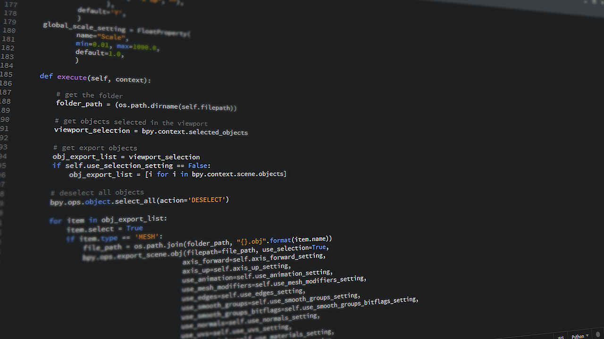

---
revealOptions:
    transition: 'none'
---


<small>
  Image credit: xkcd.com
</small>

---


## Intermediate Python
### Class 2

---

### Let's develop it


---

### Let's develop it

<div class="left-align">
  <p>Song</p>
  <ul>
      <li>Data: artist, title</li>
      <li>Behavior: play()</li>
  </ul>
</div>

---

### Let's develop it

Create a file called `music.py` and implement a `Song` class.

```python
class Song:
    def __init__(self, artist, title):
        # TODO...
```

* Finish the constructor.
* Add a `play()` method that prints out `'PLAYING: '` along with the artist and
title.

```python
song = Song(artist='Hot Chip', title='The Warning')
song.play()  # => 'PLAYING: Hot Chip - The Warning'
```

---

### Let's develop it

```python
class Song:
    def __init__(self, artist, title):
        self.artist = artist
        self.title = title

    def play(self):
        print('PLAYING: ' + self.artist + ' - ' + self.title)


song = Song(artist='Hot Chip', title='The Warning')
song.play()  # => 'PLAYING: Hot Chip - The Warning'
```

---

## Composing objects
#### or "has-a"/"has-many" relationships

---

How would we design a `Playlist` class?

---

<div class="left-align">
  <p>Playlist</p>
  <ul>
      <li>Data: name, songs, current song</li>
      <li>Behavior: play_one(), play_all(), shuffle()</li>
  </ul>
</div>

---

### Let's develop it

Add the following to `music.py`

```
class Playlist:
    def __init__(self, name):
        self.name = name
        self.current_song_index = 0
        # A list of Song instances
        self.songs = []

    def add_song(self, song):
        self.songs.append(song)

    def play_one(self):
        current_song = self.songs[self.current_song_index]
        current_song.play()
        self.current_song_index += 1
```

Note: We'll come back to this later

---

### Using our classes

```python
playlist = Playlist('Old Kanye')

song1 = Song(artist='Kanye', title='Stronger')
song2 = Song(artist='Kanye ft. Lupe Fiasco', title='Touch The Sky')

playlist.add_song(song1)
playlist.add_song(song2)
playlist.play_one()  # => PLAYING: Kanye - Stronger
```

Don't write this code just yet. We'll revisit this later.

---

### "Modularizing"

Breaking big programs into smaller parts

---

### Modularizing

* **Simplicity**: focus on on thing at a time
* **Maintainability**: changing one piece won't break other pieces
* **Reusability**: less copying and pasting!

---


Your building blocks

---

### Modules

* Collection of related code
* May contain variables, functions, and classes

---

### Built-in modules

---

### Built-in modules

Python's [standard library](https://docs.python.org/3/library/index.html)
contains lots of convenient modules

---

### Importing modules

`import math`

---

### Let's develop it

Run the `python` shell and try following

```bash
>>> import math
>>> math.sqrt(4)
2.0
```

---

### Let's develop it

Go to https://docs.python.org/3/library/math.html .

Try out some of the functions in the `math` module.

---

### Importing individual members

`from math import sqrt`

---

### Let's develop it

Try the following:

```
>>> from math import ceil, floor
>>> ceil(12.3)
13
>>> floor(45.6)
45
```

---

### Let's develop it

Now that you know how to import built-in modules, let's use modules in a
program.


---

### Let's develop it

Create a file called `coin.py`.

Write a function `flip` that randomly returns either `'H'` or `'T'`.

Hint: Check out the `random` module in the standard library.

---

```
import random

def flip():
    return random.choice(['H', 'T'])


print(flip())  # => 'H'
print(flip())  # => 'T'
print(flip())  # => 'H'
```

----

Also valid


```
from random import choice

def flip():
    return choice(['H', 'T'])
```

---

Before we move on, make sure your `coin.py` looks like this:

```python
import random

def flip():
    return random.choice(['H', 'T'])
```

Note: remove any print statements

---


### Creating your own modules

---

### Creating your own modules

Turns out, you've already created modules.

In Python, **a module is a file with a .py extension**.

<small>
Yay, no new syntax!
</small>

---

### Let's develop it

Run the `python` shell and try following

```bash
>>> import coin
>>> coin.flip()
'H'
>>> coin.flip()
'T'
>>> coin.flip()
'T'
```

---

```bash
>>> from music import Song
>>> s = Song('The Beatles', 'Help!')
>>> s.play()
PLAYING: The Beatles - Help!
```

----

### Let's develop it

In the `python` shell, import the `Song` and `Playlist`
classes. 

Make a `Song` instance and a `Playlist` instance.

Add the song to the playlist.

Then play the song.

---

```bash
>>> from music import Song, Playlist
>>> s = Song('The Beatles', 'Help!')
>>> p = Playlist('faves')
>>> p.add_song(s)
>>> p.play_one()
PLAYING: The Beatles - Help!
```

---

### Packages
#### Modularizing further...


---

### Modularizing further...

**module**: A collection of **related variables, functions, and classes**

**package**: A collection of **related modules**

---

### Packages

If a **module** is a `.py` file, what do you think a **package** is?

---

### Packages

A folder of `.py` files!

---

### Let's develop it

Create a folder called `fun`. Move `coin.py` and `music.py` into `fun`.

```
fun
├── coin.py
└── music.py
```

---

### Importing from a package

<div class="left-align">
    <code>import fun.coin</code><br>
    <code>from fun.music import Song, Playlist</code>
</div>

---

### Let's develop it

Try the following in the `python` shell:

```bash
>>> import fun.coin
>>> fun.coin.flip()
'T'
>>> from fun.music import Song
>>> Song
<class 'fun.music.Song'>
```

---

### Subpackages

Packages can be nested

```bash
fun
└── writing
   ├── base.py
   └── markers.py
├── coin.py
├── music.py
```
---

### Subpackages

```
# fun/writing/base.py
class WritingImplement:
    def __init__(self, color):
        self.color = color

    def write(self, text):
        return self.color + ': ' + text
```

```python
# fun/writing/markers.py
from fun.writing.base import WritingImplement

class DryEraseMarker(WritingImplement):
    # ...
```

---

### Absolute vs. relative imports

---

### Absolute vs. relative imports

These are equivalent.

**Absolute**

```python
# fun/writing/markers.py
from fun.writing.base import WritingImplement
```

**Relative**

```python
# fun/writing/markers.py
from .base import WritingImplement
```

---

### Absolute vs. relative imports

These are also equivalent.

**Absolute**

```python
# fun/writing/markers.py
from fun.coin import flip
```

**Relative**

```python
# fun/writing/markers.py
from ..coin import flip
```

`..` refers to the package above the current one.

---

## Let's develop it

How would we...

```bash
fun
└── writing
   ├── base.py  # <-- 1. import Song?
   └── markers.py
├── coin.py
├── music.py  # <-- 2. import DryEraseMarker?
```

---

## Let's develop it

```python
# fun/writing/base.py
from fun.songs import Song
# OR
from ..songs import Song
```

```python
# fun/music.py
from fun.writing.markers import DryEraseMarker
# OR
from .writing.markers import DryEraseMarker
```
---

### Installing 3rd-party packages
## with `pip`

---

## `pip`


A way to install packages from the <a target="_blank" href="https://pypi.org">Python Package Index</a> (PyPI)

---

### Let's develop it

```bash
pip install crayons
```

---

### Let's develop it

Run `python` and use the package you installed.


---

### Let's develop it

Now uninstall `crayons`:

```bash
pip uninstall crayons
```

---

#### Installing multiple requirements
#### `pip -r requirements.txt`

---

### Let's develop it

Create a file called `requirements.txt` with the following 2 package
names to install:

```bash
crayons
hodor
```

---

### Let's develop it

Install the packages.

```bash
pip install -r requirements.txt
```

---

### Let's develop it

List your installed packages.

```bash
pip freeze
```

---

### Let's develop it

Use your packages.


---

### Virtual environments
### *virtualenvs*

Note: To get an understanding of what virtualenvs are and why they're useful, let's look at Netflix

---


Note: Virtual environments are useful for the same reason netflix profiles are useful...avoiding conflict...

---

### The problem

Different projects on the same computer may depend on conflicting 3rd-party packages.

<small>
    They may even depend on different Python versions.
</small>

---

### The solution

Each project gets its own isolated environment with

* its own copy of `python`
* its own copy of `pip`
* its own folder of 3rd-party packages

---

### Using virtual environments
## with `pew`

"Python Env Wrapper"

---

### Install `pew`

```bash
pip install pew
```

---

### Before we get into a virtualenv...

Let's see which python we're using now.

```bash
which python
# => /usr/local/bin/python
which pip
# => /usr/local/bin/pip
```

Right now, we're using the system python.

---

### Create a new Python 3 virtualenv

```bash
pew new --python=python3 gdi
```

`pew` will automatically activate the new virtualenv

---

### Check yourself

```bash
which python
# => /Users/sloria/.local/share/virtualenvs/gdi/bin/python
which pip
# => /Users/sloria/.local/share/virtualenvs/gdi/bin/pip
```

We're no longer using the system `python`.

We're using our virtualenv's `python`.

---

### Exiting the virtualenv


Hit `ctrl+D` to exit.

```
which python
# => /usr/local/bin/python
```

Back to system python.

---

### Activating the virtualenv

```
pew workon gdi
```

```
which python
# => /Users/sloria/.local/share/virtualenvs/gdi/bin/python
```

---

### Let's develop it

* While your `gdi` virtualenv is activated, install the `django`
    package
* Enter the python shell and `import django`
* Now exit your virtualenv
* Enter the python shell and import django again. You should see an error.

---

## Questions?

---

## Looking ahead

---

### How do we go from...



to


---


### Extra practice

* Add a `play_all()` method to `Playlist` that plays all the songs in
    the playlist.
* Modify your `WritingImplement.write` method to actually print out a
colored string using the `crayons` package installed from PyPI.
* Write a script that creates two `Playlist` instances and add songs to each of them.
    Then use your `coin.flip()` function to choose which playlist to play.
    Play the chosen playlist.
