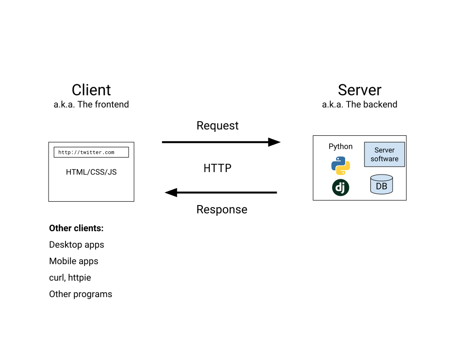

---
revealOptions:
    transition: 'none'
---

### Get ahead

Create a virtualenv called `smiles` and install Django.

```bash
pew new --python=python3 smiles
pip install django
```

Create the "smiles" app template.

```bash
django-admin startproject --template=https://github.com/sloria/smiles/archive/template.zip smiles
cd smiles
cp .env.example .env
pip install -r requirements.txt
```

---


## Intermediate Python
### Class 3

---

### How do we go from...


to


---

### How the web works

---



---


---

### Client→Server communication

The client requests information from the server in different ways:

* **HTTP Methods**, e.g. `GET`, `POST`
* **URL**, e.g. `users/<username>/`
* **Query parameters**, e.g. `/tweets/?year=2018`
* **Request body**, e.g. form data
* **Headers**

---

### Server→Client communication

The server returns responses back to the client with
the following information:

* **Status codes**, e.g. `200`, `301`, `404`
* **Headers**
* **Response body**

---

#### Let's look at a request...

```
pip install httpie
http www.google.com
```

---


---

### Further exploration

* [How the Internet Works for Developers](https://www.youtube.com/watch?v=e4S8zfLdLgQ) (2 videos)

---

### Web sites vs. Web applications

---

### Web sites vs. Web applications

**Web sites**: *Static* content; HTML/CSS/JS files only

**Web applications**: *Dynamic* content; HTML/CSS/JS on the frontend;
Server-side languages (Python, Ruby, Node.js) on the backend

---

### Web frameworks

Server-side web frameworks


---

### Web frameworks

Frameworks solve common problems

* **Routing**: Connect a request to a URL to some Python code to execute
* **Input handling**: Parse HTTP requests into Python objects
    that are easy to interact with.
* **Templating**: Separate business logic from presentation code.
* **Sessions**: Associate data with a specific user (e.g. logged in/out)
* **Database layer**: Interact with a database using Python.

---

## Let's build an app

---

### Set up

Create a virtualenv called `smiles` and install Django.

```bash
pew new --python=python3 smiles
pip install django
```

Create the "smiles" app template.

```bash
django-admin startproject --template=https://github.com/sloria/smiles/archive/template.zip smiles
cd smiles
cp .env.example .env
pip install -r requirements.txt
```

---

### Take a look around

```bash
.
├── main
│  ├── settings.py
│  ├── urls.py
│  ├── views.py
├── manage.py
├── requirements.txt
├── templates
   ├── hello.html
   └── ...

```
---

### Run your app locally

In your `smile` directory, run

```bash
python manage.py runserver
```

Enter http://localhost:8000 into your browser to view your app.

---

### Routing
#### Connecting URLs to Python functions

---

### Routing: Connecting URLs to Python functions

You define **path patterns** that will match the URLs
entered in the browser. A match will trigger the execution of a **view**
function.

**Views** are the Python functions that contain your application logic.
They return the response data.

---

### Routing: Connecting URLs to Python functions

**route** =  **path pattern** + **view**


`/hello/` → `hello(request)`

---

### Your first route

Write this **view**.

```python
# main/views.py

def hello(request):
    return HttpResponse('Hello World')
```

---

### Your first route

Add a new **path pattern**.

```python
# main/urls.py
from . import views

urlpatterns = [
    path('hello/', views.hello),
    # ...
]
```

Browse to

http://localhost:8000/hello/

---

http://localhost:8000/hello/


---

### Query parameters

`/hello/?name=Casey`

---

### Query parameters

`request.GET` is a dictionary containing the query parameters.

```
def hello(request):
    name = request.GET.get('name', 'World')
    return HttpResponse('Hello ' + name)
```

Browse to

http://localhost:8000/hello/?name=Casey 


---


http://localhost:8000/hello/?name=Casey


---

### Templating
#### Filling in HTML with dynamic content

---

### Templating

Building HTML manually is pain.

```python
def myview(request):
    name = 'Casey'
    return HttpResponse(
        '<html>' +
            '<body>' +
                '<h1>' +
                'Hello '+ name +
                '</h1>' +
            '</body>' +
        '</html>'
    )
```

---

### Templating

Separate data ("context") from HTML.

---

### Templating

Context:

```
{'name': 'Casey'}
```

Template:

```jinja
<html>
  <body>
    <h1>
      Hello {{name}}
    </h1>
  </body>
</html>
```


---

### Using a template

```python
# main/views.py

def hello(request):
    name = request.GET.get('name', 'World')
    # Templates are specified relative to the templates/ directory
    return render(request, 'hello.html', context={'name': name})
```

```jinja
{# templates/hello.html #}

{# TODO: WRITE YOUR CODE BELOW #}
Hello {{name}}
{# END #}
```

Browse to

http://localhost:8000/hello/

http://localhost:8000/hello/?name=Casey 

---

### Let's develop it

/coin/


---

### Let's develop it

Make a new route, `/coin/`, that uses the `main.coin.flip` function.

Render `templates/coin.html` with the word "Heads"
or "Tails" depending on the result of the flip.

The view has been started in `main.views.coin_flip`. **Start there.**

---


```python
# main/views.py
from . import coin

def coin_flip(request):
    result = coin.flip()
    if result == 'H':
        text = 'Heads'
    else:
        text = 'Tails'
    return render(request, 'coin.html', context={'text': text})

```

---

```python
# main/urls.py

urlpatterns = [
    # ...
    path('coin/', views.coin_flip),
    # ...
]
```

---

```jinja
{# templates/coin.html #}

<h1 class="f-6 tc code">
  {{text}}
</h1>
```
---

http://localhost:8000/coin/


---

## POST requests
### Handling form data


---


---

### POST requests

```jinja
{# templates/hello_with_form.html #}

<form method="POST" action="/hello_form">
  <input name="name"  /> {# <-- The data being sent #}
  <input type="submit">
</form>
```

`request.POST` is a dictionary of incoming form data.

```python
# main/views.py

def hello_form(request):
    if request.method == 'POST':
        name = request.POST['name']  # <-- 'name' field from the form
    else:
        name = 'World'
    context = {'name': name}
    return render(request, 'hello_with_form.html', context=context)
```

---

### Let's develop it

Modify the `hello_form` view to the following:

```python
# main/views.py

def hello_form(request):
    if request.method == 'POST':
        name = request.POST['name']  # <-- 'name' field from the form
    else:
        name = 'World'
    context = {'name': name}
    return render(request, 'hello_with_form.html', context=context)
```

Then hook up `hello2/` to the `hello_form` view in `main/urls.py`.

---

```python
# main/urls.py

urlpatterns = [
    # ...
    path('hello2/', views.hello_form),
    # ...
]
```
---

http://localhost:8000/hello2/


----

If you try to refresh the page...


----

### Redirecting

----

### Redirecting

The `redirect()` call will send a 302 redirect back to `/hello2/`

```python
# main/views.py

def hello_form(request):
    if request.method == 'POST':
        name = request.POST['name']
        return redirect('/hello2/?name=' + name)
    else:
        name = request.GET.get('name', 'World')
    return render(request, 'hello_with_form.html', context={'name': name})
```
----

### Redirecting


---


## Questions?


---

## Looking ahead

### http://smiles.sloria.com
