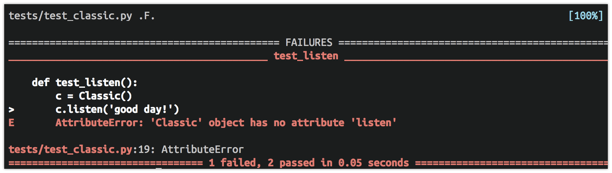

---
revealOptions:
    transition: 'none'
---

### Get ahead

* Activate your `smiles` virtualenv
* Open `smiles/` in your editor.
* Open your terminal and navigate to the `smiles/` directory.

---


## Intermediate Python
### Class 4

---


---

### Review

* What are some ways the client communicates information to the server?
* What are some ways the server communicates information to the client?

---

### Path variables
#### Passing information in URLs

---

`/hello_path/Casey/`


---

### Path variables

Add this to `main/urls.py`

```python
# main/urls.py

urlpatterns = [
    # ...
    path('hello_path/<name>/', views.hello_path),
    # ...
]
```

---

### Path variables

Path variables get passed as arguments to view functions.

```python
# main/views.py

def hello_path(request, name):
    return render(request, 'hello.html', context={'name': name})
```

Then visit http://localhost:8000/hello_path/Casey/

---

http://localhost:8000/hello_path/Casey/


---

What if there's no `<name>` in the URL?

---

The desired behavior:

`/hello_path/`


---

### Let's develop it

`/hello_path/`


---

### Let's develop it

Add a path in `main/urls.py` to hook up `hello_path/` to the `hello_path` view.

**Watch out!** The `urlpatterns` list is ordered by precedence.
In other words, earlier items in the list will match before later items.

---

```python
# main/urls.py

urlpatterns = [
    # ...
    path('hello_path/', views.hello_path),
    path('hello_path/<name>/', views.hello_path),
    # ...
]
```

---

`/hello_path/`


To fix this we need to learn about **default arguments**.

---

```python
# main/views.py

def hello_path(request, name):
    return render(request, 'hello.html', context={'name': name})
```

---

### Default arguments

Default arguments are optional.

```python
def greet(name, time='morning'):
    return 'Good ' + time + ', ' + name

greet('Quinn')  # Good morning, Quinn
greet('Quinn', 'afternoon')  # Good afternoon, Quinn
greet('Quinn', time='night')  # Good night, Quinn
```

---

Add `'World'` as the default argument for `name`.

```python
def hello_path(request, name='World'):
    return render(request, 'hello.html', context={'name': name})
```

---

`/hello_path/`


---

## Testing
#### Writing code to save time

---

```python
def yo(name):
    return 'Yo ' + name

def test_yo():
    assert greet('Casey')  == 'Yo Casey'
    assert greet('Henrique') == 'Yo Henrique'
```

---

Run the tests in `tests/test_coin.py`.

```
pytest tests/test_coin.py
```

---


---

Fix the `test_flip` test.

```python
# tests/test_coin.py

def test_flip():
    result = coin.flip()
    assert result in ['H', 'T']
```

Then rerun the tests.

```bash
pytest tests/test_coin.py
```

Tip: Use the up arrow to get the previous command in your terminal.

---


---

### Test-driven development

---

### Test-driven development
#### "Red-Green-Refactor"

* **Write the test first** and watch it fail.
* Write the code to make the test pass.
* Improve the code (*refactor*).

---

### Let's develop it

Open `tests/test_coin.py`.

`flip_loaded()` will always return `'H'`.

Write an assertion for `test_flip_loaded()`.

---

### Let's develop it

```
# tests/test_coin.py

def test_flip_loaded():
    assert coin.flip_loaded() == 'H'
```

Run the tests.

```bash
pytest tests/test_coin.py
```

---

Failure is expected.


---

Now fix `flip_loaded()`.

```python
# main/coins.py
# ...

def flip_loaded():
    return 'H'
```

Run the tests.

```bash
pytest tests/test_coin.py
```

---

## All green!


---

## The smiles app

### Putting it all together

---

### The smiles app

Build an app that allows the user to "say" things (send input) to
a character. The app display's the character's face based on the
sentiment of the user's input.

---

### The smiles app

A character has 5 "moods" which are associated with a face and a color.

<div class="left-align">
  <ul>
      <li> Very negative, :'-( , dark-red</li>
      <li>Slightly negative, :-( , red</li>
      <li>Neutral, :-| , lightest-blue</li>
      <li>Slightly positive, :-) , washed-green</li>
      <li>Very positive, :-D , green</li>
  </ul>
</div>

---

# :-|

First step: Design a character. Let's start with the `Classic` character.

---


---

Run the tests.

```
pytest tests/test_classic.py
```


These tests will serve as a guide.

---

### Let's develop it

`get_face()` has already been implemented. 

Now implement `get_color()` to make `test_get_color()` pass.

Hint: `get_color()` should look very similar to `get_face()`.

---

### Let's develop it

Implement `get_color()`.

<div class="left-align">
  <ul>
      <li> Very negative, :'-( , dark-red</li>
      <li>Slightly negative, :-( , red</li>
      <li>Neutral, :-| , lightest-blue</li>
      <li>Slightly positive, :-) , washed-green</li>
      <li>Very positive, :-D , green</li>
  </ul>
</div>

---

### Checkpoint

```
pytest tests/test_classic.py
```



---

Next let's implement `listen(text)`.

We'll use the TextBlob package to compute the sentiment of text.

---

### Using TextBlob

"Sentiment polarity" measures the positivity/negativity of text.

Here's how to get it with TextBlob

```python
from textblob import TextBlob
good_blob = TextBlob('good day!')
good_blob.sentiment.polarity  # 0.875
bad_blob = TextBlob('bad day!')
bad_blob.sentiment.polarity  # -0.875
```

---

### Let's develop it

The `listen(text)` method should change the character's mood to 
the sentiment polarity of `text`. If `text` is `None` or `''` ,
reset the `mood` to `0.0`.

Here's the start:

```python
def listen(self, text):
    # If text is empty, reset mood to 0
    if not text:
        self.mood = 0.0
```

Use TextBlob to compute sentiment polarity.

```python
from textblob import TextBlob
good_blob = TextBlob('good day!')
good_blob.sentiment.polarity  # 0.875
bad_blob = TextBlob('bad day!')
bad_blob.sentiment.polarity  # -0.875
```

---

### Checkpoint

```
pytest tests/test_classic.py
```


If you get ahead, try implementing `Bear` or `Bird`. Run `pytest
tests/test_more_characters.py` to test them.

---

### Let's develop it

* Run your server with `python manage.py runserver` and go to
http://localhost:8000 in your browser
* Edit `main/urls.py` to hook up the root (`''`)
and `'<character_id>/'` to the `character_page` view.
* Edit `templates/character.html` to display the face in the right place.
---

```jinja
{# templates/character.html #}

<h1 class="f-6 tc sans-serif">
  {{ face }}
</h1>
```

```python
# main/urls.py

urlpatterns = [
    # ...
    path('', views.character_page),
    path('<character_id>/', views.character_page),
]
```

Now visit http://localhost:8000/ or http://localhost:8000/classic/

---


---

### Let's develop it

Now implement the full `Bear` class.
It should have the same behavior as `Classic`
except with different faces.

Run the following tests.

```
pytest tests/test_more_characters.py
```

Tip: You'll need to open another terminal window
in order to run your tests.

---


### Checkpoint


---

### Let's develop it

* In `templates/character.html`, uncomment the link to `/bear/`.

```jinja
{# TODO: Uncomment these after you've implemented Bear and Bird #}
<a class="link grow black-80 hover-blue    f6 f5-ns dib mr3" href="/bear/" title="About">Bear</a>
```

* Edit `main/views.py` to use the `Bear` class when `bear/` is passed
    in the URL.

---

## Refactoring!

---

### Refactoring

`Classic` and `Bear` have a lot of the same behavior.
How can we reduce the duplicated code?

---


---

### Let's develop it

Implement a `Character` class from which `Classic` and `Bear` both inherit.


---

### Let's develop it

Hint: Use class variables to store the faces.

```python
class Character:
    # ...
    def get_face(self):
        if self.mood < -0.5:  # very negative
            return self.very_negative
        # ...

class Classic(Character):
    very_negative = ":'-("
    slightly_negative = ':-('
    # ...
```

---

## You made it!

---

Before you close your terminal, don't forget to shut down your
development server using `ctrl-c`.

---

### More practice

Implement `Bird` and hook it up to `/bird/`.

---

### More practice

Read the `character_page` view.
Can you understand its logic?

---

### More practice

Learn about Python's `@property` syntax
and refactor `get_face()` and `get_color`
as properties.

Don't forget to change the tests!

---

### What next?

* **Learn HTML/CSS/JS**
  * [MDN Learn Web Development](https://developer.mozilla.org/en-US/docs/Learn)
  * GDI classes (Intro to HTML/CSS, Intro to JS)
* **Build an app that uses a database**
  * Go through the official [Django Tutorial](https://docs.djangoproject.com/en/2.0/intro/)
* **See what else Python can do**
  * [Hitchhiker's Guide to Python](http://docs.python-guide.org/en/latest/)
  * [Full Stack Python](https://www.fullstackpython.com/best-python-resources.html)
* **Learn git**
  * [Try Git](https://try.github.io) - 15 min tutorial
* **Deploy your app**
  * Follow [these
      instructions](https://github.com/sloria/smiles#deploying-to-heroku)
      for deploying to Heroku
* **Learn more about testing**
  * [pythontesting.net](http://pythontesting.net/)
